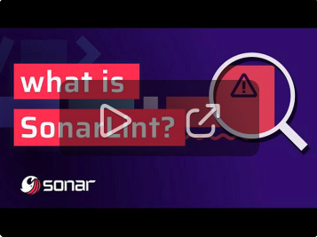

# SonarQube for IDE: Visual Studio Code (formerly SonarLint)

SonarQube for IDE by [Sonar](https://www.sonarsource.com/) is a free IDE extension that empowers you to fix coding issues before they exist. More than a linter, SonarQube for IDE detects and highlights issues that can lead to bugs, vulnerabilities, and code smells as you create your code.  It offers clear remediation guidance and educational help, so you can fix issues before the code is committed.
Out of the box, SonarQube for IDE: Visual Studio Code supports analysis of JS/TS, Python, PHP, Java, C, C++, C#, Go, and IaC code locally in your IDE.

By default, SonarQube for IDE analyzes files **open** in the IDE. When paired with SonarQube ([Server](https://www.sonarsource.com/products/sonarqube/), [Cloud](https://www.sonarsource.com/products/sonarcloud/)) in Connected Mode, SonarQube for IDE forms a powerful end-to-end code quality platform to enrich the CI/CD pipeline, ensuring any code edits or additions **across the whole project** are clean.
In Connected Mode, your team can share common language rulesets, project analysis settings and [more](https://docs.sonarsource.com/sonarlint/vs-code/team-features/connected-mode/).

<a href='https://www.youtube.com/watch?v=Ks4Slmzb1qY' target='_blank'></a>

Check the [SonarQube for IDE: VS Code documentation](https://docs.sonarsource.com/sonarlint/vs-code/) for the most up-to-date requirements, installation instructions, and feature details.

Sonar's [Clean Code solutions](https://www.sonarsource.com/solutions/clean-code/) help developers deliver high-quality, efficient code standards that benefit the entire team or organization. 

## How it works

Simply open any source file, start coding, and you will start seeing issues reported by SonarQube for IDE. Issues are highlighted in your code and also listed in the 'Problems' panel.


You can access the detailed rule description directly from your editor, using the provided contextual menu.


Watch the [SonarQube for IDE: VSCode Overview](https://www.youtube.com/watch?v=m8sAdYCIWhY) video to explore SonarQube for IDE: VS Code features.

<a href='https://www.youtube.com/watch?v=m8sAdYCIWhY' target='_blank'></a>


## Static Analysis Rules

Out of the box, SonarQube for IDE: VS Code automatically checks your code against the following rules:

- [Azure Resource Manager rules](https://rules.sonarsource.com/azureresourcemanager)
- [C rules](https://rules.sonarsource.com/c)
- [C++ rules](https://rules.sonarsource.com/cpp)
- [C# rules](https://rules.sonarsource.com/csharp/)
- [CloudFormation rules](https://rules.sonarsource.com/cloudformation)
- [CSS rules](https://rules.sonarsource.com/css)
- [Docker rules](https://rules.sonarsource.com/docker)
- [Go rules](https://rules.sonarsource.com/go)
- [HTML rules](https://rules.sonarsource.com/html)
- [Java rules](https://rules.sonarsource.com/java)
- [JavaScript rules](https://rules.sonarsource.com/javascript)
- [Kubernetes rules](https://rules.sonarsource.com/kubernetes)
- [Python and IPython notebook rules](https://rules.sonarsource.com/python)
- [PHP rules](https://rules.sonarsource.com/php)
- [Secrets rules](https://rules.sonarsource.com/secrets)
- [Terraform rules](https://rules.sonarsource.com/terraform)
- [TypeScript rules](https://rules.sonarsource.com/typescript)

The full list of supported languages and rules is available in [our docs](https://docs.sonarsource.com/sonarlint/vs-code/using-sonarlint/rules/).

## Requirements

The SonarQube for IDE language server needs a Java Runtime (JRE) 17+.

On the following platforms, SonarQube for IDE: VS Code comes with its own Java runtime:

- Windows x86-64
- Linux x86-64
- macOS x86-64 (Intel Macs) and arm-64 (Apple Silicon Macs)

On other platforms and if a Java runtime is already installed on your computer, SonarQube for IDE: VS Code should automatically find and use it. Here is how SonarQube for IDE will search for an installed JRE (in priority order):

1. the `sonarlint.ls.javaHome` variable in VS Code settings if set. For instance:

   ```json
   {
     "sonarlint.ls.javaHome": "C:\\Program Files\\Java\\jdk-17"
   }
   ```

2. embedded JRE for platform-specific installations
3. the value of the `JDK_HOME` environment variable if set
4. the value of the `JAVA_HOME` environment variable if set
5. on Windows the registry is queried
6. if a JRE is still not found then:
   1. the `PATH` is scanned for `javac`
   2. on macOS, the parent directory of `javac` is checked for a `java_home` binary. If that binary exists then it is executed and the result is used
   3. the grandparent directory of `javac` is used. This is similar to `$(dirname $(dirname $(readlink $(which javac))))`

SonarQube for IDE: VS Code then uses the first JRE found in these steps to check its version.

If a suitable JRE cannot be found at those places, SonarQube for IDE: VS Code will ask for your permission to download and manage its own version.

### JS/TS analysis specific requirements

To analyze JavaScript and TypeScript code, SonarQube for IDE requires a Node.js executable. The minimal supported version is `18.18` for standalone analysis or Connected Mode with SonarQube Cloud. For Connected Mode with SonarQube Server, it depends on the version of the JS/TS analyzer on your SonarQube server. SonarQube for IDE will attempt to automatically locate Node, or you can force the location using:

```json
{
  "sonarlint.pathToNodeExecutable": "/home/yourname/.nvm/versions/node/v18.18.0/bin/node"
}
```

Analysis of TypeScript in Connected Mode with SonarQube requires the server to use version 8.1 or above.

### C and C++ analysis specific requirements

To analyze C and C++ code, SonarQube for IDE: VS Code requires [compile commands json file](https://docs.sonarsource.com/sonarlint/vs-code/getting-started/running-an-analysis/#analyze-c-and-cpp-code):

```json
{
  "sonarlint.pathToCompileCommands": "/home/yourname/repos/proj/compile_commands.json"
}
```

Note: if you are using Microsoft compiler, the environment should be ready to build the code. For example, by launching VS Code from your Visual Studio Command Prompt

### Java analysis specific requirements

To enable the support for Java analysis, you need the [Language support for Java](https://marketplace.visualstudio.com/items?itemName=redhat.java) VSCode extension (version 0.56.0 or higher). You also need to be in [standard mode](https://code.visualstudio.com/docs/java/java-project#_lightweight-mode).

### Apex analysis specific requirements

The support for Apex analysis is only available together with SonarQube Server Enterprise Edition or SonarQube Cloud (see Connected Mode below). You also need the [Salesforce Extension Pack](https://marketplace.visualstudio.com/items?itemName=salesforce.salesforcedx-vscode) VSCode extension.

### PL/SQL analysis specific requirements

The support for PL/SQL analysis is only available together with SonarQube Server Developer Edition or SonarQube Cloud (see Connected Mode below). You also need the [Oracle Developer Tools for VS Code](https://marketplace.visualstudio.com/items?itemName=Oracle.oracledevtools) extension.

### COBOL analysis specific requirements

The support for COBOL analysis is only available together with SonarQube Server Enterprise Edition or SonarQube Cloud (see Connected Mode below). You also need an extension that declares the COBOL language; SonarQube for IDE has been tested with the [IBM Z Open Editor](https://marketplace.visualstudio.com/items?itemName=IBM.zopeneditor) and [Micro Focus COBOL](https://marketplace.visualstudio.com/items?itemName=Micro-Focus-AMC.mfcobol) extensions.

### Jupyter notebooks

SonarQube for IDE: VS Code supports analysis of Python code inside Jupyter notebooks. See the [documentation](https://docs.sonarsource.com/sonarlint/vs-code/using-sonarlint/scan-my-project/#jupyter-notebooks) page for details.

### Injection vulnerabilities specific requirements

Security vulnerabilities requiring taint engine analysis (taint vulnerabilities) are only available in Connected Mode because SonarQube for IDE pulls them from SonarQube (Server, Cloud) following a project analysis.

To browse injection vulnerabilities in SonarQube for IDE: VS Code, establish [Connected Mode](https://docs.sonarsource.com/sonarlint/vs-code/team-features/connected-mode/) with your SonarQube Server Developer Edition (and above) or SonarQube Cloud instance. Once a [Project Binding](https://docs.sonarsource.com/sonarlint/vs-code/team-features/connected-mode-setup/#project-binding) is configured, SonarQube for IDE will synchronize with the SonarQube (Server, Cloud) to report the detected injection vulnerabilities.

More information about security-related rules is available in the SonarQube ([Server](https://docs.sonarqube.org/latest/user-guide/security-rules/), [Cloud](https://docs.sonarcloud.io/digging-deeper/security-related-rules/)) documentation.

### Security Hotspots in SonarQube for IDE: VS Code

Local detection of [Security Hotspots](https://docs.sonarsource.com/sonarlint/vs-code/using-sonarlint/security-hotspots/) is enabled if you are using [Connected Mode](https://docs.sonarsource.com/sonarlint/vs-code/team-features/connected-mode/) with SonarQube Server 9.9 or above, or SonarQube Cloud.

Please see the [documentation](https://docs.sonarsource.com/sonarlint/vs-code/using-sonarlint/security-hotspots/) for more details.

### Secrets detection

Secrets are pieces of user-specific or system-level credentials that should be protected and accessible to legitimate users only. SonarQube for IDE detects exposed Secrets in your source code and language-agnostic config files. When running in Connected Mode, the SonarQube (Server, Cloud) Quality Profiles are applied to locally detected Secrets.

## Connected Mode

You can connect SonarQube for IDE to [SonarQube Server](https://www.sonarsource.com/products/sonarqube/) 9.9+ or [SonarQube Cloud](https://www.sonarsource.com/products/sonarcloud/) by binding your VSCode workspace folder to your SonarQube (Server, Cloud) project(s), and benefit from the same rules and settings that are used to inspect your project on the server. SonarQube for IDE: VS Code then hides **Accepted** (formerly **Won’t Fix**) and **False Positive** issues in any file from a bound folder.

While in Connected Mode, SonarQube for IDE receives notifications from SonarQube (Server, Cloud) about your Quality Gate changes and new issues. Notifications can be enabled or disabled from the UI while creating or editing the connection settings.

When running in Connected Mode, and browsing a [Security Hotspot](https://docs.sonarsource.com/sonarlint/vs-code/using-sonarlint/security-hotspots/), a button will be available offering to open the hotspot in SonarQube for IDE (with SonarQube for IDE already running in VSCode). Limitation: this feature relies on local communication between your web browser and SonarQube for IDE, and consequently is not available in some remote environments such as GitPod, or GitHub CodeSpaces.

Connected Mode will also unlock your analysis of these languages:

- [Apex rules](https://rules.sonarsource.com/apex)
- [COBOL rules](https://rules.sonarsource.com/cobol)
- [PL/SQL rules](https://rules.sonarsource.com/plsql)
- [T-SQL rules](https://rules.sonarsource.com/tsql/)

When configuring Connected Mode, follow the [Connection Setup instructions](https://docs.sonarsource.com/sonarlint/vs-code/team-features/connected-mode-setup/#connection-setup).

## Other settings

It is possible to specify extra analyzer properties that will be used for analysis. Example:

```jsonc
// In project/.vscode/settings.json
{
  "sonarlint.analyzerProperties": {
    "sonar.javascript.node.maxspace": "4096"
  }
}
```

## Contributions

Have a need in SonarQube for IDE: VS Code that’s not being met? Or not being met well? Ever wish you could talk directly to the Product Manager? Well now’s your chance! Congratulations, you are SonarQube's Product Manager for a day. If you would like to see a new feature, please create a new thread in the Community Forum here, under ["Product Manager for a Day"](https://community.sonarsource.com/c/sl/pm-for-a-day-sl/41). 

Please read here about why we [deprecated the "Suggest New Features" category](https://community.sonarsource.com/t/introducing-the-product-manager-for-a-day-subcategories/68606) on the Community Forum. The truth is that it's extremely difficult for someone outside SonarSource to comply with our roadmap and expectations. Therefore, we typically only accept minor cosmetic changes and typo fixes.

With that in mind, if you would like to submit a code contribution, please create a pull request for this repository. Please explain your motives to contribute: what problem you are trying to fix, what improvement you are trying to make.

Make sure that you follow our [code style](https://github.com/SonarSource/sonar-developer-toolset#code-style) and all tests are passing.

## Have Questions or Feedback?

For SonarQube for IDE support questions ("How do I?", "I got this error, why?", ...), please first read the [FAQ](https://community.sonarsource.com/t/frequently-asked-questions/7204) and then head to the [Sonar forum](https://community.sonarsource.com/c/help/sl). There are chances that a question similar to yours has already been answered.

Be aware that this forum is a community, so the standard pleasantries ("Hi", "Thanks", ...) are expected. And if you don't get an answer to your thread, you should sit on your hands for at least three days before bumping it. Operators are not standing by. :-)

Issue tracker (read-only): https://jira.sonarsource.com/browse/SLVSCODE

## License

Copyright 2017-2024 SonarSource.

Licensed under the [GNU Lesser General Public License, Version 3.0](http://www.gnu.org/licenses/lgpl.txt)

## Data and telemetry

This extension collects anonymous usage data and sends it to SonarSource to help improve SonarQube for IDE: VS Code functionality.  No source code or IP address is collected, and SonarSource does not share the data with anyone else. Collection of telemetry is controlled via the setting: `sonarlint.disableTelemetry`. Click [here](telemetry-sample.md) to see a sample of the data that are collected.
