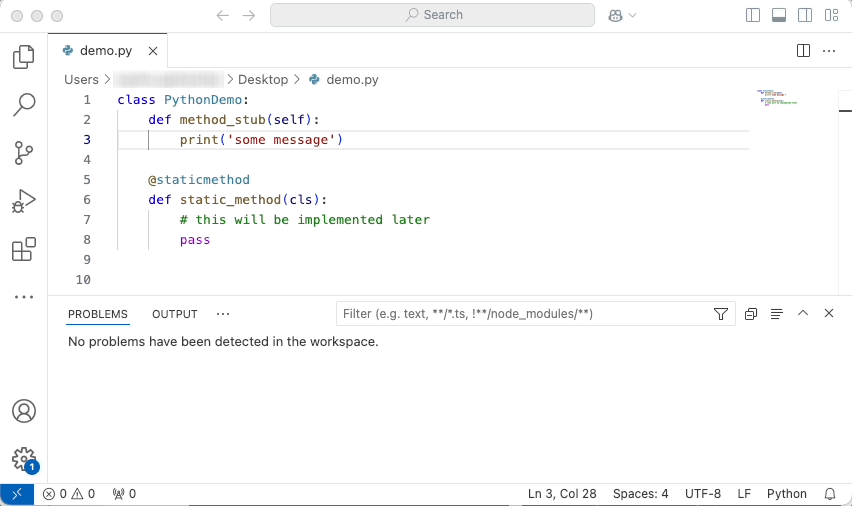
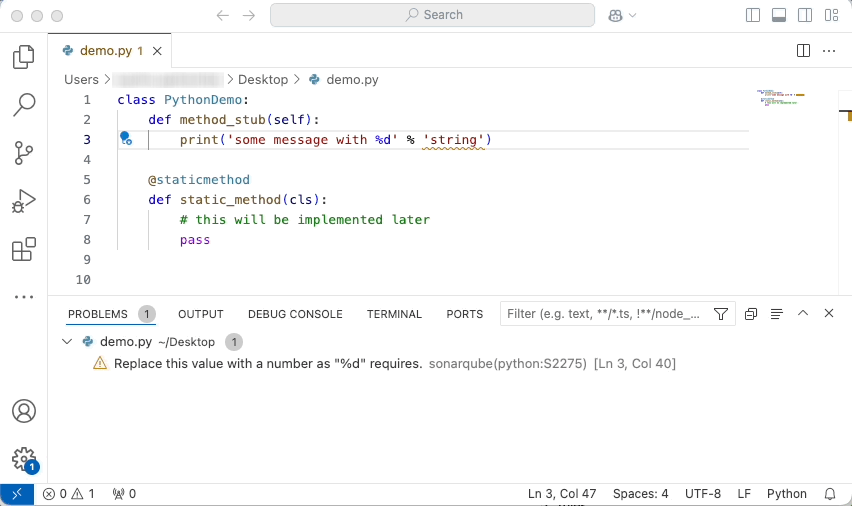
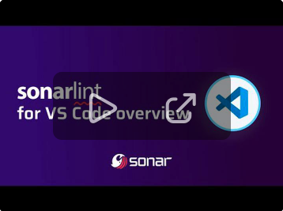

# SonarQube for IDE: Visual Studio Code (formerly SonarLint)

SonarQube for IDE by [Sonar](https://www.sonarsource.com/) is a free, sophisticated static analysis tool that enhances your code quality and security. Analyze your code early—as you write or generate it. Local analysis automatically identifies quality and security issues in real-time, even with AI-generated code. Fix issues found using QuickFix or the AI CodeFix feature, before pushing to your SCM. This ensures your code meets your quality standards and is safe for running in production. 

Understand the "why" behind issues with detailed contextual information, turning SonarQube for IDE into your personal coding tutor, and levelling up your coding skills.

Connect to [SonarQube Server](https://www.sonarsource.com/products/sonarqube/) or [SonarQube Cloud](https://www.sonarsource.com/products/sonarcloud/) (you can create a [free SonarQube Cloud account](https://www.sonarsource.com/products/sonarcloud/signup/) to get started), to create a powerful, unified code quality platform for your team, throughout the software development lifecycle. [This connection](https://docs.sonarsource.com/sonarqube-for-vs-code/team-features/connected-mode/) enables sharing of consistent language rulesets and project settings, and unlocks analysis of deeply hidden security issues, fostering collaboration and code uniformity. Additionally, Connected Mode unlocks analysis of languages such as COBOL, Apex, PL/SQL, T-SQL, and Ansible.

SonarQube for IDE is the only extension you need in VS Code for ensuring both code quality and security. It supports a wide range of languages, including C, C++, Java, Go, JavaScript, TypeScript, Python, C#, HTML, CSS, PHP, Kubernetes, Docker and PL/SQL. Refer to our documentation for the complete list of supported languages, rules, and secret detection capabilities. 

Get started for free. Check the [Requirements](https://docs.sonarsource.com/sonarqube-for-vs-code/getting-started/requirements/) and [Installation](https://docs.sonarsource.com/sonarqube-for-vs-code/getting-started/installation/) pages — download SonarQube for IDE in the Extension Marketplace and enjoy safe coding!

## How it works

Simply open any source file, start coding, and you will start seeing issues reported by SonarQube for IDE. Issues are highlighted in your code and also listed in the 'Problems' panel.

You can access the detailed rule description directly from your editor, using the provided contextual menu.

Watch the [SonarQube for IDE: VSCode Overview](https://www.youtube.com/watch?v=m8sAdYCIWhY) video to explore SonarQube for IDE: VS Code features.

## Contributions

Have a need in SonarQube for IDE: VS Code that’s not being met? Or not being met well? Ever wish you could talk directly to the Product Manager? Well now’s your chance! Congratulations, you are SonarQube's Product Manager for a day. If you would like to see a new feature, please create a new thread in the Community Forum here, under ["Product Manager for a Day"](https://community.sonarsource.com/c/sl/pm-for-a-day-sl/41). 

Please read here about why we [deprecated the "Suggest New Features" category](https://community.sonarsource.com/t/introducing-the-product-manager-for-a-day-subcategories/68606) on the Community Forum. The truth is that it's extremely difficult for someone outside SonarSource to comply with our roadmap and expectations. Therefore, we typically only accept minor cosmetic changes and typo fixes.

With that in mind, if you would like to submit a code contribution, please create a pull request for this repository. Please explain your motives to contribute: what problem you are trying to fix, what improvement you are trying to make.

Make sure that you follow our [code style](https://github.com/SonarSource/sonar-developer-toolset#code-style) and all tests are passing.

## Have Questions or Feedback?

For SonarQube for IDE support questions ("How do I?", "I got this error, why?", ...), please first read the [FAQ](https://community.sonarsource.com/t/frequently-asked-questions/7204) and then head to the [Sonar forum](https://community.sonarsource.com/c/help/sl). There are chances that a question similar to yours has already been answered.

Be aware that this forum is a community, so the standard pleasantries ("Hi", "Thanks", ...) are expected. And if you don't get an answer to your thread, you should sit on your hands for at least three days before bumping it. Operators are not standing by. :-)

Issue tracker (read-only): https://jira.sonarsource.com/browse/SLVSCODE

## License

Copyright 2017-2025 SonarSource.

Licensed under the [GNU Lesser General Public License, Version 3.0](http://www.gnu.org/licenses/lgpl.txt)

## Data and telemetry

This extension collects anonymous usage data and sends it to SonarSource to help improve SonarQube for IDE: VS Code functionality.  No source code or IP address is collected, and SonarSource does not share the data with anyone else. Collection of telemetry is controlled via the setting: `sonarlint.disableTelemetry`. Click [here](telemetry-sample.md) to see a sample of the data that are collected.
