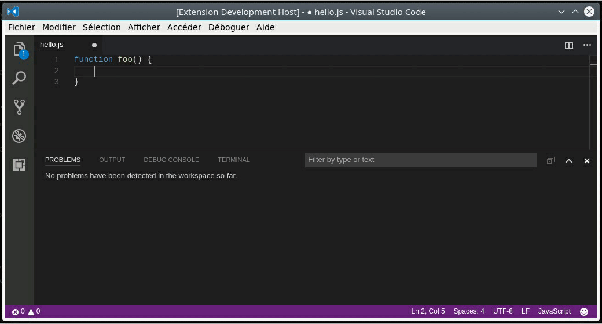
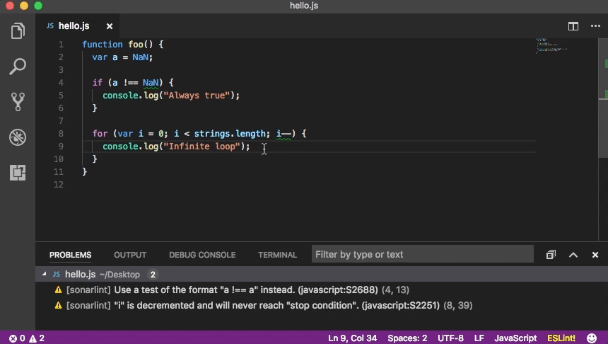

# SonarLint for Visual Studio Code

SonarLint is an IDE extension that helps you detect and fix quality issues as you write code. Like a spell checker, SonarLint squiggles flaws so they can be fixed before committing code. You can get it directly from the VS Code Marketplace and it will then detect new bugs and quality issues as you code (JavaScript, TypeScript, PHP and Python)

## How it works

Simply open a JS, TS, Python or PHP file, start coding, and you will start seeing issues reported by SonarLint. Issues are highlighted in your code, and also listed in the 'Problems' panel.

You can access the detailed rule description directly from your editor, using the provided contextual menu.

## Rules

Check the rules to see what SonarLint can do for you:

- [JavaScript rules](https://rules.sonarsource.com/javascript)
- [TypeScript rules](https://rules.sonarsource.com/typescript)
- [Python rules](https://rules.sonarsource.com/python)
- [PHP rules](https://rules.sonarsource.com/php)

You will benefit from the following code analyzers: [SonarJS](https://redirect.sonarsource.com/plugins/javascript.html), [SonarTS](https://redirect.sonarsource.com/plugins/typescript.html), [SonarPython](https://redirect.sonarsource.com/plugins/python.html) and [SonarPHP](https://redirect.sonarsource.com/plugins/php.html)

## Requirements

The only thing you need is a Java Runtime (JRE) 8 installed on your computer.

SonarLint should automatically find it but you can also explicitly set the path where the JRE is installed using the 'sonarlint.ls.javaHome' variable in VS Code settings. For example:

    {
        "sonarlint.ls.javaHome": "C:\Program Files\Java\jre1.8.0_131"
    }

### Connected mode

You can connect SonarLint to SonarQube >= 5.6 or SonarCloud to benefit from the same rules and settings that are used to inspect your project on the server. SonarLint then hides in VSCode the issues that are marked as **Won’t Fix** or **False Positive**.

To configure the connection, have a look at SonarLint in default user settings.

If you change something on the server such as the quality profile, you can trigger an update of the local cache using the "Update SonarLint binding to SonarQube/SonarCloud" command on the command palette (search for "sonarlint").

For security reasons, the token should not be stored in SCM with workspace settings.

## Contributions

If you would like to see a new feature, please create a new thread in the forum ["Suggest new features"](https://community.sonarsource.com/c/suggestions/features).

Please be aware that we are not actively looking for feature contributions. The truth is that it's extremely difficult for someone outside SonarSource to comply with our roadmap and expectations. Therefore, we typically only accept minor cosmetic changes and typo fixes.

With that in mind, if you would like to submit a code contribution, please create a pull request for this repository. Please explain your motives to contribute this change: what problem you are trying to fix, what improvement you are trying to make.

Make sure that you follow our [code style](https://github.com/SonarSource/sonar-developer-toolset#code-style) and all tests are passing.

## Have Question or Feedback?

For SonarLint support questions ("How do I?", "I got this error, why?", ...), please first read the [FAQ](https://community.sonarsource.com/t/frequently-asked-questions/7204) and then head to the [SonarSource forum](https://community.sonarsource.com/c/help/sl). There are chances that a question similar to yours has already been answered. 

Be aware that this forum is a community, so the standard pleasantries ("Hi", "Thanks", ...) are expected. And if you don't get an answer to your thread, you should sit on your hands for at least three days before bumping it. Operators are not standing by. :-)

Issue tracker: https://jira.sonarsource.com/browse/SLVSCODE

## License

Copyright 2017-2019 SonarSource.

Licensed under the [GNU Lesser General Public License, Version 3.0](http://www.gnu.org/licenses/lgpl.txt)