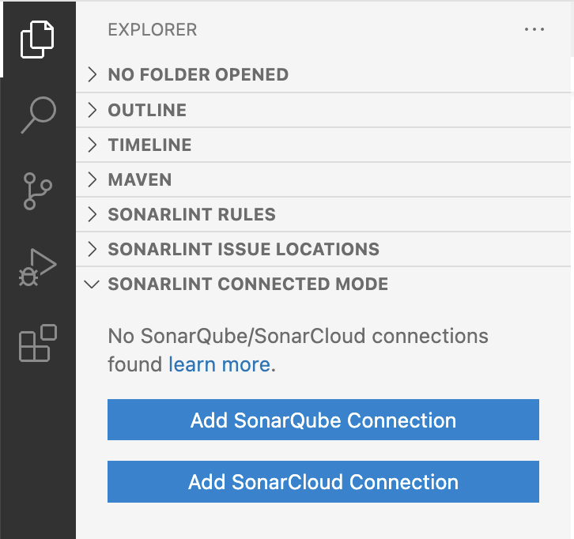
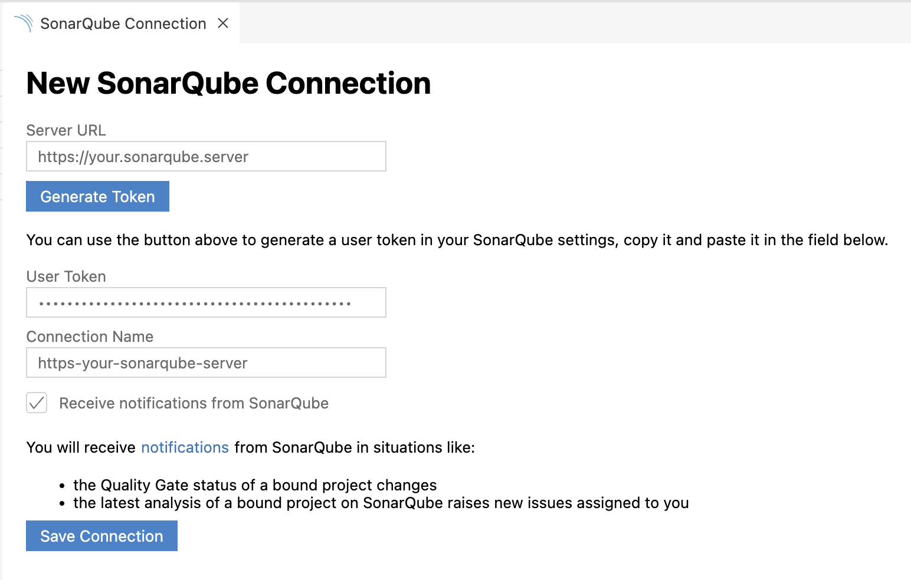
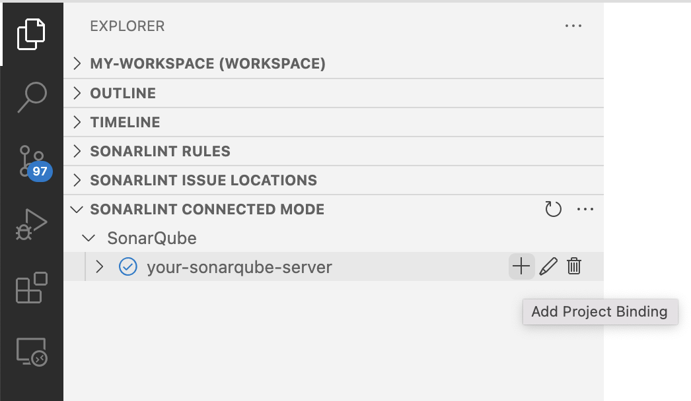
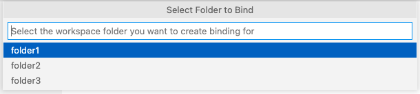
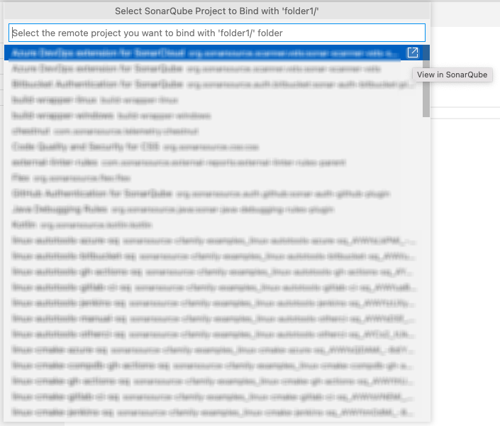
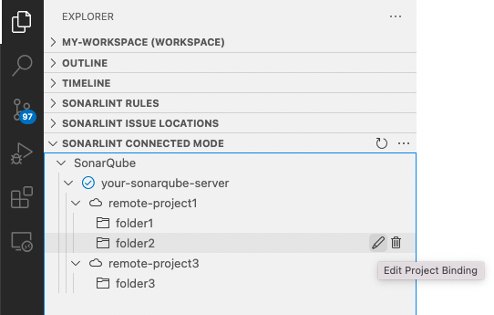

# SonarLint for Visual Studio Code

SonarLint is a free IDE extension that lets you fix coding issues before they exist! Like a spell checker, SonarLint highlights Bugs and Security Vulnerabilities as you write code, with clear remediation guidance so you can fix them before the code is even committed. SonarLint in VS Code supports analysis of C, C++, HTML, Java, JavaScript, PHP, Python and TypeScript, and you can install it directly from the VS Code Marketplace!

## How it works

Simply open any source file, start coding, and you will start seeing issues reported by SonarLint. Issues are highlighted in your code, and also listed in the 'Problems' panel.


You can access the detailed rule description directly from your editor, using the provided contextual menu.


## Static Analysis Rules

Out of the box, SonarLint automatically checks your code against the following rules:

- [JavaScript rules](https://rules.sonarsource.com/javascript)
- [TypeScript rules](https://rules.sonarsource.com/typescript)
- [C rules](https://rules.sonarsource.com/c)
- [C++ rules](https://rules.sonarsource.com/cpp)
- [CSS rules](https://rules.sonarsource.com/css)
- [Python rules](https://rules.sonarsource.com/python)
- [Java rules](https://rules.sonarsource.com/java)
- [HTML rules](https://rules.sonarsource.com/html)
- [PHP rules](https://rules.sonarsource.com/php)
- [Secrets rules](https://rules.sonarsource.com/secrets)

The full list of available rules is visible in the "SonarLint Rules" view in the explorer, where you can activate and deactivate rules to match your conventions. SonarLint will also show a code action on each issue to quickly deactivate the corresponding rule.

## Requirements

The SonarLint language server needs a Java Runtime (JRE) 11+.

On the following platforms, SonarLint comes with its own Java runtime:
- Windows x86-64
- Linux x86-64
- macOS x86-64 (Intel Macs) and arm-64 (Apple Silicon Macs)

On other platforms and if a Java runtime is already installed on your computer, SonarLint should automatically find and use it. Here is how SonarLint will search for an installed JRE (in priority order):

1. the `sonarlint.ls.javaHome` variable in VS Code settings if set. For instance:

    {
        "sonarlint.ls.javaHome": "C:\\Program Files\\Java\\jre-11.0.11"
    }
2. embedded JRE for platform-specific installations
3. the value of the `JDK_HOME` environment variable if set
4. the value of the `JAVA_HOME` environment variable if set
5. on Windows the registry is queried
6. if a JRE is still not found then:
   1. the `PATH` is scanned for `javac`
   2. on macOS, the parent directory of `javac` is checked for a `java_home` binary. If that binary exists then it is executed and the result is used
   3. the grandparent directory of `javac` is used. This is similar to `$(dirname $(dirname $(readlink $(which javac))))`

SonarLint then uses the first JRE found in these steps to check its version.

If a suitable JRE cannot be found at those places, SonarLint will ask for your permission to download and manage its own version.

### JS/TS analysis specific requirements

To analyze JavaScript and TypeScript code, SonarLint requires Node.js executable. The minimal supported version is `14.17.0` for standalone analysis or Connected Mode with SonarCloud. For Connected Mode with SonarQube, it depends on the version of the JS/TS analyzer on your SonarQube server. SonarLint will attempt to automatically locate node, or you can force the location using:

```json
    {
        "sonarlint.pathToNodeExecutable": "/home/yourname/.nvm/versions/node/v14.17.0/bin/node"
    }
```

Analysis of TypeScript in Connected Mode with SonarQube requires the server to use version 8.1 or above.

### C and C++ analysis specific requirements

To analyze C and C++ code, SonarLint requires [compile commands json file](https://github.com/SonarSource/sonarlint-vscode/wiki/C-and-CPP-Analysis):

```json
    {
        "sonarlint.pathToCompileCommands": "/home/yourname/repos/proj/compile_commands.json"
    }
```

Note: if you are using Microsoft compiler, the environment should be ready to build the code. For example, by launching VS Code from your Visual Studio Command Prompt

### Java analysis specific requirements

To enable the support for Java analysis, you need the [Language support for Java](https://marketplace.visualstudio.com/items?itemName=redhat.java) VSCode extension (version 0.56.0 or higher). You also need to be in [standard mode](https://code.visualstudio.com/docs/java/java-project#_lightweight-mode).

### Apex analysis specific requirements

The support for Apex analysis is only available together with SonarQube Enterprise Edition or SonarCloud (see Connected Mode below). You also need the [Salesforce Extension Pack](https://marketplace.visualstudio.com/items?itemName=salesforce.salesforcedx-vscode) VSCode extension.

### PL/SQL analysis specific requirements

The support for PL/SQL analysis is only available together with SonarQube Developer Edition or SonarCloud (see Connected Mode below). You also need the [Oracle Developer Tools for VSCode](https://marketplace.visualstudio.com/items?itemName=Oracle.oracledevtools) extension.

### Injection vulnerabilities specific requirements

Security vulnerabilities requiring taint engine analysis (taint vulnerabilities) are only available in Connected Mode because SonarLint pulls them from SonarQube or SonarCloud following a project analysis.

To browse injection vulnerabilities in SonarLint for VSCode, establish [Connected Mode](https://github.com/SonarSource/sonarlint-vscode#connected-mode5) with your SonarQube Developer Edition (and above) or SonarCloud instance. Once a [Project Binding](https://github.com/SonarSource/sonarlint-vscode#project-binding) is configured, SonarLint will synchronize with the SonarQube or SonarCloud server to report the detected injection vulnerabilities.

More information about security-related rules are available in the [SonarQube](https://docs.sonarqube.org/latest/user-guide/security-rules/) or [SonarCloud](https://docs.sonarcloud.io/digging-deeper/security-related-rules/) documentation.

### Security Hotspots in SonarLint
​
In SonarLint for VS Code 3.14 and above, local detection of [Security Hotspots](https://docs.sonarqube.org/latest/user-guide/security-hotspots/) is enabled if you are using [Connected Mode](https://github.com/SonarSource/sonarlint-vscode/wiki/Connected-Mode) with SonarQube 9.7 or above.

Please see the [documentation](https://github.com/SonarSource/sonarlint-vscode/wiki/Security-hotspots) for more details. 

### Secrets detection
Secrets are pieces of user-specific or system-level credentials that should be protected and accessible to legitimate users only. SonarLint detects exposed Secrets in your source code and language agnostic config files. When running in Connected Mode, the SonarQube or SonarCloud Quality Profiles are applied to locally detected Secrets.

## Connected Mode

You can connect SonarLint to SonarQube 7.9+/SonarCloud by binding your VSCode workspace folder to your SonarQube/SonarCloud project(s), and benefit from the same rules and settings that are used to inspect your project on the server. SonarLint in VSCode then hides **Won’t Fix** and **False Positive** issues in any file from a bound folder. 

While in Connected Mode, SonarLint receives notifications from SonarQube/SonarCloud about your Quality Gate changes and new issues. Notifications can be enabled or disabled from the UI while creating or editing the connection settings. For editing notificaitons in previous versions, please see [SonarLint Versions 3.5.4 and Lower](https://github.com/SonarSource/sonarlint-vscode/wiki/Connected-Mode#sonarlint-versions-354-and-lower). Note that Connected Mode notifications are not available in the SonarQube Community Editions 8.6 and earlier.

When running in Connected Mode with SonarQube 8.6 and above, and browsing a [security hotspot](https://docs.sonarqube.org/latest/user-guide/security-hotspots/), a button will be available offering to open the hotspot in SonarLint (with SonarLint already running in VSCode). Limitation: this feature relies on local communication between your web browser and SonarLint, and consequently is not available in some remote environments such as GitPod, or GitHub CodeSpaces.

Connected Mode will also allow unlocking of your analysis for these languages:

- [Apex rules](https://rules.sonarsource.com/apex)
- [PL/SQL rules](https://rules.sonarsource.com/plsql)

When configuring Connected Mode, follow the [Connection Setup instructions](#connection-setup) below.

## Connection Setup
In SonarLint v3.6 and above for VSCode, to set up SonarQube/SonarCloud connections, open a **SONARLINT CONNECTED MODE** view in VSCode.



Select either **Add SonarQube Connection** or **Add SonarCloud Connection**, and complete the fields.



For SonarQube connections, provide your SonarQube **Server URL** and **User Token**. For SonarCloud connections, provide your **Organization Key** and **User Token**. User Tokens should be generated on the SonarQube/SonarCloud side and pasted in the **User Token** field.

User Token can be generated using these pages:
* SonarQube - `https://<your-sonarqube-url>/account/security/`
* SonarCloud - `https://sonarcloud.io/account/security/`

**Connection Name** is a friendly name for your connections. In case of multiple connections, it also acts as a `connectionId`.

In SonarLint for VSCode v3.6 and above, notifications can be enabled or disabled here, or from the UI while creating or editing the connection setting. Action buttons in the UI used to edit/delete existing, or create additional connections will be revealed when hovering over each connection (see next image).

Select **Save Connection** and verify that the new connection was set up successfully in the Connected Mode view.

To set up a Connected Mode for SonarLint v3.5.4 and lower, please see the relevant wiki for [Connection Setup](https://github.com/SonarSource/sonarlint-vscode/wiki/Connected-Mode#connection-setup).

### Project Binding
SonarLint keeps server-side data in a local storage. If you change something on the server such as the Quality Profile, SonarLint will automatically attempt to synchronize with configured servers at startup & once every hour, and will do its best to [synchronize with the most appropriate branch from the server](https://github.com/SonarSource/sonarlint-vscode/wiki/Branches-awareness). Additionally, you can trigger an update of the local storage using the "SonarLint: Update all project bindings to SonarQube/SonarCloud" command on the command palette (search for "sonarlint"). 

### Project Binding Setup

From v3.10, SonarLint for VSCode tries to automatically detect a remote SonarQube/SonarCloud project to bind with the locally opened workspace folder. If the locally opened folder contains a `sonar-project.properties` or a `.sonarcloud.properties` file, SonarLint will try to configure the binding with the remote project defined in that configuration file.

If no remote match is found, you will be prompted to configure binding manually.

To manually configure a project binding, navigate to the **SONARLINT CONNECTED MODE** view in the VSCode Explorer and select **Add Project Binding** to add the desired connection.




If your open workspace contains multiple folders, you will be prompted to choose a specific folder.




After selecting the folder, choose the remote SonarQube/SonarCloud project you would like to bind.




Select the desired project and enjoy Connected Mode!
You can also edit/delete bindings from the **SONARLINT CONNECTED MODE** view.



Action buttons in the UI used to edit/delete existing, or create additional bindings will be revealed when hovering over each connection.

### Connected Mode and Bindings in SonarLint Version 3.7 or earlier

For earlier versions, please see the relevant wiki to configure your [Connection Setup](https://github.com/SonarSource/sonarlint-vscode/wiki/Connected-Mode#connection-setup).


## Other settings

It is possible to specify extra analyzer properties that will be used for analysis. Example:

```json
    // In project/.vscode/settings.json
    {
        "sonarlint.analyzerProperties": {
            "sonar.javascript.node.maxspace": "4096"
        }
    }
```

## Contributions

Have a need in SonarLint that’s not being met? Or not being met well? Ever wish you could talk directly to the Product Manager? Well now’s your chance! Congratulations, you are SonarLint’s Product Manager for a day. If you would like to see a new feature, please create a new thread in the Community Forum here, under ["Product Manager for a Day"](https://community.sonarsource.com/c/sl/pm-for-a-day-sl/41). 

Please read here about why we [deprecated the "Suggest New Features" category](https://community.sonarsource.com/t/introducing-the-product-manager-for-a-day-subcategories/68606) on the Community Forum. The truth is that it's extremely difficult for someone outside SonarSource to comply with our roadmap and expectations. Therefore, we typically only accept minor cosmetic changes and typo fixes.

With that in mind, if you would like to submit a code contribution, please create a pull request for this repository. Please explain your motives to contribute this change: what problem you are trying to fix, what improvement you are trying to make.

Make sure that you follow our [code style](https://github.com/SonarSource/sonar-developer-toolset#code-style) and all tests are passing.

## Have Questions or Feedback?

For SonarLint support questions ("How do I?", "I got this error, why?", ...), please first read the [FAQ](https://community.sonarsource.com/t/frequently-asked-questions/7204) and then head to the [SonarSource forum](https://community.sonarsource.com/c/help/sl). There are chances that a question similar to yours has already been answered.

Be aware that this forum is a community, so the standard pleasantries ("Hi", "Thanks", ...) are expected. And if you don't get an answer to your thread, you should sit on your hands for at least three days before bumping it. Operators are not standing by. :-)

Issue tracker (readonly): https://jira.sonarsource.com/browse/SLVSCODE

## License

Copyright 2017-2023 SonarSource.

Licensed under the [GNU Lesser General Public License, Version 3.0](http://www.gnu.org/licenses/lgpl.txt)

## Data and telemetry

This extension collects anonymous usage data and sends it to SonarSource to help improve SonarLint functionality.  No source code nor IP address is collected, and SonarSource does not share the data with anyone else. Collection of telemetry is controlled via the setting: `sonarlint.disableTelemetry`. Click [here](telemetry-sample.md) to see a sample of the data that are collected.

